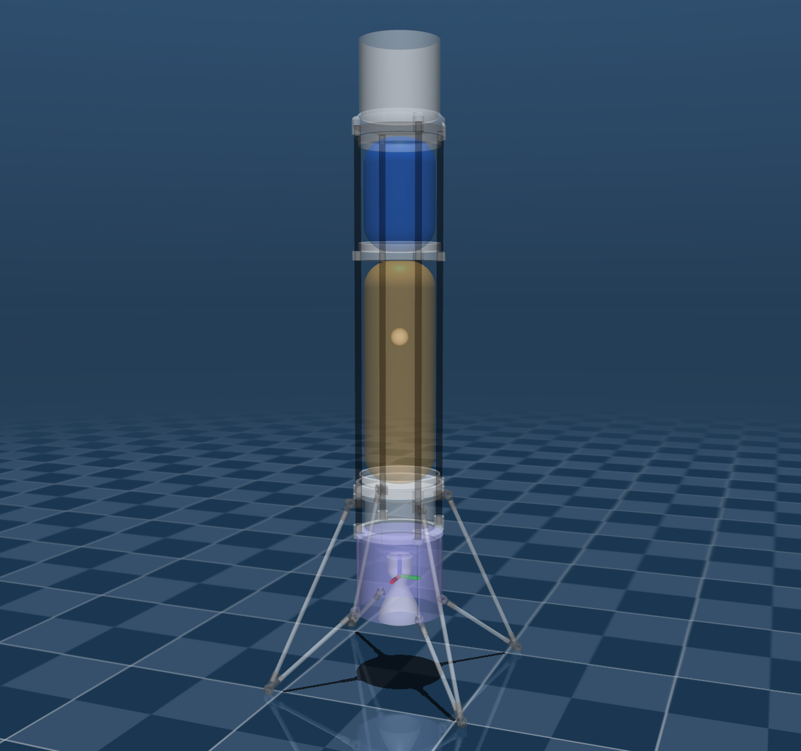
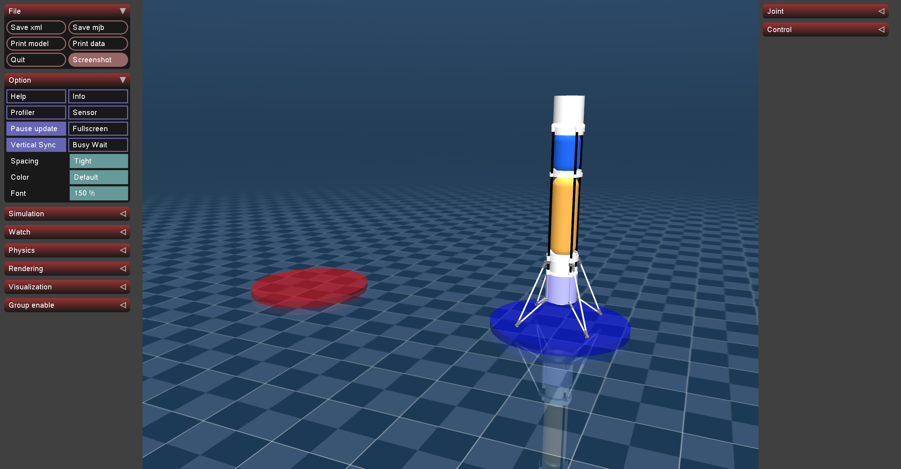
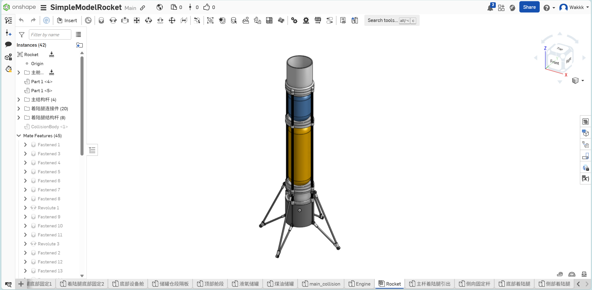

## Simple Model Rocket





### Model Information

mass: 20.0kg

max thrust: 400N

min thrust: 0N

二维矢量喷管摆动，最大摆动角度30°

箭体主体高度：1.3m

箭体总体高度(含着陆腿高度)：1.43m

推力作用点机体坐标系坐标：(0.0, 0.0, -0.55)m

惯性数据：

```xml
<inertial pos="0 0 0.55" mass="20.0" diaginertia="2.88279167 2.88279167 0.13225"/>
```

Mujoco Actuator:

```xml
  <actuator>
    <motor class="VTOL" ctrlrange="0 400" gear="0 0 1 0 0 0" site="engine_site" name="thrust_z"/>
    <motor class="VTOL" ctrlrange="-200 200" gear="1 0 0 0 0 0" site="engine_site" name="thrust_x"/>
    <motor class="VTOL" ctrlrange="-200 200" gear="0 1 0 0 0 0" site="engine_site" name="thrust_y"/>
  </actuator>
```

### Onshape 3D Model

https://cad.onshape.com/documents/a3e96e516dd102157dca9c6c/w/abae3af7a2f0cc86397f8bed/e/bfa1d2be8bd8f209ea324e1a?renderMode=0&uiState=67f75aa1f96534376fccfbb0



### LQR 6-DOF Control

使用$\Omega = [\phi ,\theta, \psi ]^T$表示欧拉角，使用$\omega_B$表示机体坐标系中角速度，则欧拉角导数$\dot{\Omega}$和角速度的关系为：
$$
\dot{\Omega} = \begin{bmatrix}
\dot{\phi} \\
\dot{\theta} \\
\dot{\psi}
\end{bmatrix}
=\begin{bmatrix}
1  & \sin \phi\tan \theta & \cos \phi \tan\theta\\
0  & \cos\phi & -\sin\phi\\
0  & \frac{\sin\phi}{\cos\theta}  & \frac{\cos\phi}{\cos\theta} 
\end{bmatrix}
\begin{bmatrix}
\omega _x \\
\omega _y \\
\omega _z
\end{bmatrix}
= \mathrm{M}^{-1}\omega_B 
$$
其中矩阵$\mathrm{M}$：
$$
\mathrm{M}=\begin{bmatrix}
 1 & 0 & -\sin\theta \\
 0 & \cos\phi & \cos\theta \sin\phi\\
 0 & -\sin\phi & \cos\theta \cos\phi 
\end{bmatrix}
$$
**欧拉角旋转矩阵**
$$
\mathbf{R}_b^w(\psi, \theta, \phi) = \mathbf{R}_z(\psi) \cdot \mathbf{R}_y(\theta) \cdot \mathbf{R}_x(\phi) 
$$

$$
\mathbf{R}_b^w(\psi, \theta, \phi) = 
\begin{bmatrix}
c \theta c \psi & s \phi s \theta c \psi - c \phi s \psi & c \phi s \theta c \psi + s \phi s \psi \\
c \theta s \psi & s \phi s \theta s \psi + c \phi c \psi & c \phi s \theta s \psi - s \phi c \psi \\
-s \theta & s \phi c \theta & c \phi c \theta
\end{bmatrix}
$$

其中：
$$
s \phi, s \theta, s \psi = \sin(\phi), \sin(\theta), \sin(\psi) 
$$

$$
c \phi, c \theta, c \psi = \cos(\phi), \cos(\theta), \cos(\psi)
$$

**旋转**
$$
\begin{bmatrix} 
F \\ 
\tau 
\end{bmatrix} = 
\begin{bmatrix} 
m \, I_3 & 0 \\ 
0 & J 
\end{bmatrix} 
\begin{bmatrix} 
\dot{v} \\ 
\dot{\omega} 
\end{bmatrix} + 
\begin{bmatrix} 
0 \\ 
\omega \times J\omega
\end{bmatrix}
$$
**矢量喷管**

两个相互垂直独立的旋转轴，构成二维推力矢量。

对于矢量角度的定义：$\alpha>0$表示产生x轴正向旋转力矩，$\beta>0$表示产生y轴正向旋转力矩。

则推力矢量在机体坐标系为：
$$
\begin{bmatrix}
t_x \\
t_y \\
t_z
\end{bmatrix}
=
\begin{bmatrix}
-t\cos\alpha\sin\beta \\
t\sin\alpha \\
t\cos\alpha\cos\beta
\end{bmatrix}
$$
推力小角度近似：
$$
\begin{bmatrix}
t_x \\
t_y \\
t_z
\end{bmatrix}
=
\begin{bmatrix}
-t_{hov}\beta\\
t_{hov}\alpha \\
t
\end{bmatrix}
$$


设发动机推力作用点到机体重心的距离为$d$，则发动机推力产生的力矩，以及Z轴辅助RCS产生的力矩为：
$$
\begin{bmatrix}
\tau_x \\
\tau_y \\
\tau_z
\end{bmatrix}
=
\begin{bmatrix}
\frac{t_y}{d}  \\
\frac{-t_x}{d}  \\
\tau_{RCS}
\end{bmatrix}
=
\begin{bmatrix}
\frac{t\sin\alpha }{d}  \\
\frac{t\cos\alpha\sin\beta}{d}  \\
\tau_{RCS}
\end{bmatrix}
$$
力矩小角度近似：
$$
\begin{bmatrix}
\tau_x \\
\tau_y \\
\tau_z
\end{bmatrix}
=
\begin{bmatrix}
\frac{t\alpha }{d}  \\
\frac{t\beta}{d} \\
\tau_{RCS}
\end{bmatrix}
$$


机体坐标系角加速度和力矩的关系：
$$
\begin{bmatrix}
\dot{\omega }_x \\
\dot{\omega }_y \\
\dot{\omega }_z
\end{bmatrix}
=
\mathbf{J}^{-1}\left ( 
\begin{bmatrix}
\tau_x \\
\tau_y \\
\tau_z
\end{bmatrix}
-
\begin{bmatrix}
\omega_x \\
\omega_y \\
\omega_z
\end{bmatrix}
\times 
\mathbf{J}
\begin{bmatrix}
\omega_x \\
\omega_y \\
\omega_z
\end{bmatrix}
 \right ) 
$$

$$
\dot{\omega}_x = \frac{1}{J_{xx}} \tau_x + \frac{1}{J_{xx}}(J_{yy}-J_{zz}) \omega _y\omega _z
$$

$$
\dot{\omega}_y = \frac{1}{J_{yy}} \tau_y + \frac{1}{J_{yy}}(J_{zz}-J_{xx}) \omega _x\omega _z
$$

$$
\dot{\omega}_z = \frac{1}{J_{zz}} \tau_z + \frac{1}{J_{zz}}(J_{xx}-J_{yy}) \omega _x\omega _y
$$

角加速度小角度近似：
$$
\begin{bmatrix}
\dot{\omega }_x  \\
\dot{\omega }_y \\
\dot{\omega }_z
\end{bmatrix}
=
\begin{bmatrix}
\frac{t\alpha }{J_{xx}d}  \\
\frac{t\beta}{J_{yy}d} \\
\frac{\tau_{RCS}}{J_{zz}}
\end{bmatrix}
$$


机体坐标系速度导数：
$$
\begin{bmatrix}
\dot{v}_x \\
\dot{v}_y \\
\dot{v}_z
\end{bmatrix}
=
\begin{bmatrix}
\frac{-t\cos\alpha\sin\beta}{m} \\
\frac{t\sin\alpha}{m} \\
\frac{t\cos\alpha\cos\beta}{m}
\end{bmatrix}
+
\begin{bmatrix}
g\sin\theta  \\
-g\cos\theta \sin\phi \\
-g\cos\theta\cos\phi
\end{bmatrix}
$$
机体坐标系速度导数(小角度近似)：
$$
\begin{bmatrix}
\dot{v}_x \\
\dot{v}_y \\
\dot{v}_z
\end{bmatrix}
=
\begin{bmatrix}
\frac{-t_{hov}\beta}{m}  \\
\frac{t_{hov}\alpha }{m}  \\
\frac{t }{m}
\end{bmatrix}
+
\begin{bmatrix}
g\theta  \\
-g\phi \\
-g
\end{bmatrix}
$$
使用的12维度状态向量：
$$
\mathbf{x}=[x,y,z,v_x,v_y,v_z,\phi,\theta,\psi, \omega_x, \omega_y,\omega_z]^T
$$
4维度控制向量：
$$
\mathbf{u}=[\alpha,\beta,\gamma, t]^T
$$
系统转移矩阵A：
$$
\mathbf{A}=
\begin{bmatrix}
\mathbf{0}_3  & \mathbf{I}_3 &  \mathbf{0}_3 & \mathbf{0}_3\\
 \mathbf{0}_3 & \mathbf{0}_3 & 

\begin{bmatrix}
0  & g & 0\\
-g  & 0 & 0\\
0  & 0 &0
\end{bmatrix}

 & \mathbf{0}_3\\
\mathbf{0}_3  & \mathbf{0}_3 & \mathbf{0}_3 &  \mathbf{I}_3\\
\mathbf{0}_3  & \mathbf{0}_3 & \mathbf{0}_3 &\mathbf{0}_3 
\end{bmatrix}
$$
系统控制矩阵B：
$$
\mathbf{B}=
\begin{bmatrix}
\mathbf{0}_3 \\
\begin{bmatrix}
 0 & \frac{-t_{hov}}{m}  & 0\\
 \frac{t_{hov}}{m}  & 0 & 0\\
 0 & 0 & \frac{1}{m} 
\end{bmatrix} \\
\mathbf{0}_3 \\
\begin{bmatrix}
\frac{t_{hov}}{J_{xx}d}   & 0 & 0\\
0  & \frac{t_{hov}}{J_{yy}d}  & 0\\
 0 & 0 &0
\end{bmatrix}
\end{bmatrix}
$$
系统连续方程：
$$
\dot{\mathbf{x}}=\mathbf{A}\mathbf{x}+\mathbf{B}\mathbf{u}
$$

### 运行 Running

```shell
python main.py
```

